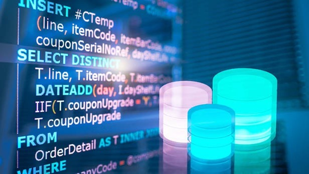
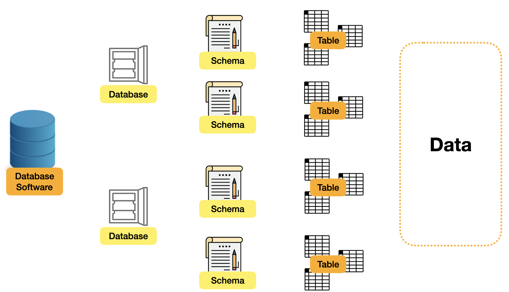

# SQL: Structured Query Language 🏛️


## Biggest difference SQL vs other languages like python 🐍: 

```the Design Logic! ```

The `syntax` of SQL focuses on the logic of **grouping**; while most other programming languages focus more on **procedure**, which uses linear thinking. So even if we are already good at writing one programming language, some effort will still be required to become familiar with SQL. 

## Content
1. [SQL Data Structure](sql_data_structure.sql)
    - Schema
    - Table
    - Column

2. [SQL SynTax](sql_syntax.sql)
3. TO BE ADDED...


## General DataBase Structure


## 💡 Let's break it down...
 1. **Database Software**: It can be regarded as common database software, such as MySQL, Postgre SQL, MsSQL, etc. We will use MySQL here.
2. **Database:** We can divide different databases' structures into database software. In general, we can separate data entities with different commercial meanings. For example, the US stock data can be set in one database, and the London stock data can be set in another database.

3. **Schema**: This is a collection of Tables, which can be split and grouped according to logic, and some table details meta settings can be set on this layer, like a blueprint. But in some database software, such as MySQL, Schema and Database are integrated into one. 

4. **Table**: The key section of the database. Tables record different data entities, such as users, products, etc. Each table is responsible for recording the column size, type, and default value... of each row data in the database. 

5. **Data**: The most valuable part of the database is the data itself. Different types of data can be stored.
